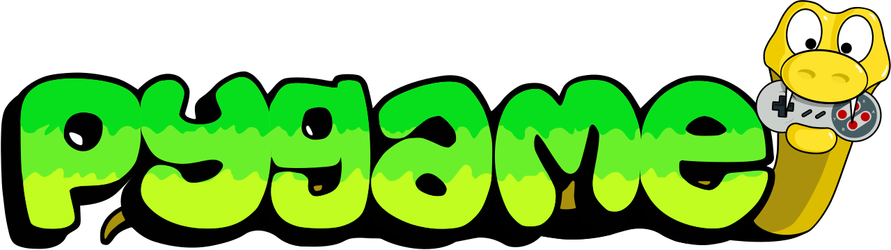
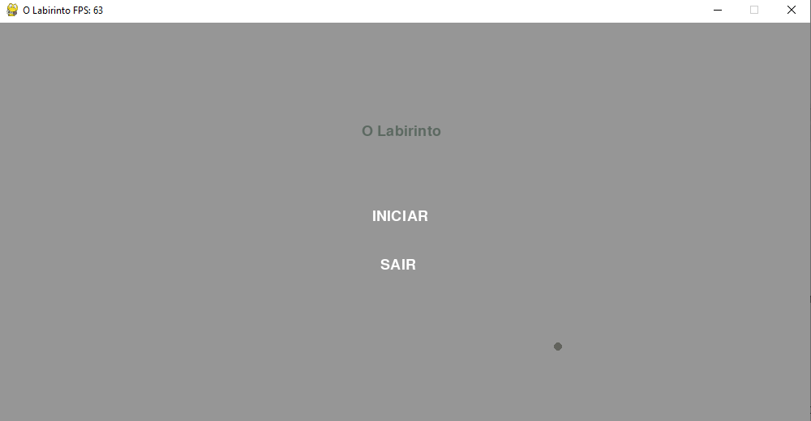
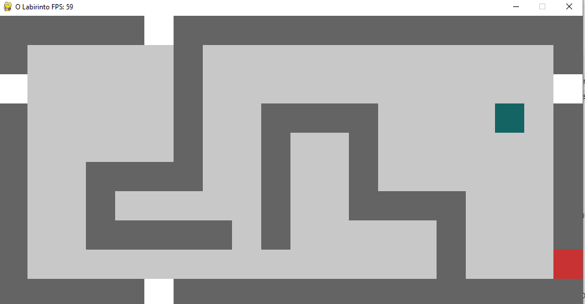
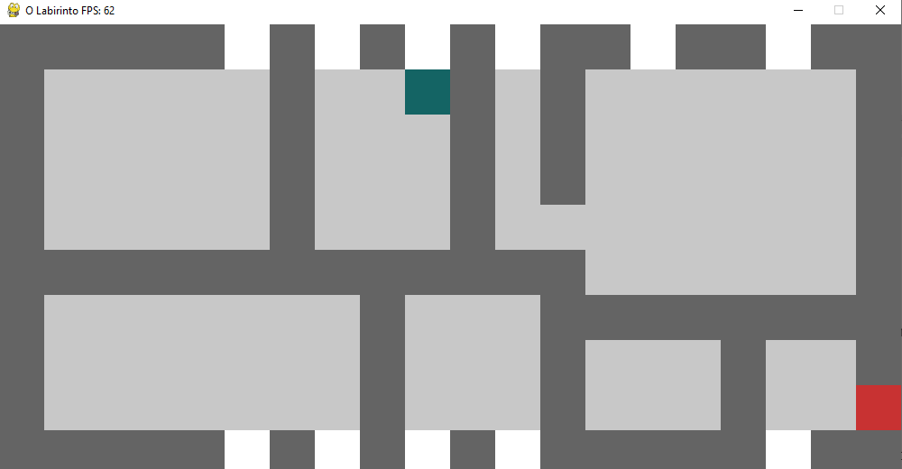

<!-- Usei este modelo como base de edição: https://github.com/othneildrew/Best-README-Template -->
<a id="readme-top"></a>

<!-- PROJECT LOGO -->
<br />
<div align="center">
  
  
  <h2 align="center">Maze Game</h2>

  <p align="center">
    An academic activity to learn python and pygame
    <br/>
  </p>
</div>
<!-- END: PROJECT LOGO -->

<!-- Tabela de resumo -->
<details>
  <summary>Summary</summary>
  <ol>
    <!-- Primeiro: About -->
    <li>
      <a href="#about-the-project">About the Project</a>
      <ul>
        <li><a href="#build-with">Build With</a></li>
      </ul>
    </li>
    <!-- Segundo: Descrição (com sublista) -->
    <li>
      <a href="#getting-started">Getting Started</a>
      <ul>
        <li><a href="#prerequisites">Prerequisites</a></li>
      </ul>
      <ul>
        <li><a href="#installation">Installation</a></li>
      </ul>
    </li>
    <!-- Quarto: Como executar o projeto -->
    <li>
      <a href="#screenshots">Screenshots</a>
    </li>
    <!-- Sétimo: Futuras Melhorias -->
    <li>
      <a href="#future-plans">Future Plans</a>
    </li>
    <!-- Oitavo: Licença -->
    <li>
      <a href="#license">License</a>
    </li>
  </ol>
</details>
<!-- END: Tabela de resumo -->

<!-- SOBRE O PROJETO -->
## About The Project
This little game was developed to my college of game development, it was my first game during that course, its simple, you just need to get on the red square, and the white squares take you to the other side of the map.
</br>

<!-- Funcionalidades -->
#### Build With

- **Python** and **PyGame**

<!-- END: Funcionalidades -->

<p align="right">(<a href="#readme-top">top</a>)</p>
<!-- END: Descrição de projeto -->

<!-- Como Executar o Projeto -->
## Getting Started
### Prerequisites
- **Python** 
- **PyGame**
### Installation
1. Clone the repo ```git clone https://github.com/MalcolnLMR/maze-game.git```
2. Install `requirements.txt` with `pip install -r requirements.txt`
3. Run `python main.py`
4. Have fun :D

<p align="right">(<a href="#readme-top">top</a>)</p>
<!-- END: Como Executar o Projeto -->

<!-- Capturas de tela -->
## Screenshots
<div align="center">
  
  
  
</div>

<p align="right">(<a href="#readme-top">top</a>)</p>
<!-- END: Capturas de tela -->

<!-- Futuras Melhorias -->
## Future Plans
1. English version (yes, the menu is in brazillian portuguese only)
2. Music and SFX

<p align="right">(<a href="#readme-top">top</a>)</p>
<!-- END: Futuras Melhorias -->

<!-- LICENSE -->
## License

Distributed under the MIT. See `LICENSE` for more information.

<p align="right">(<a href="#readme-top">top</a>)</p>
<!-- END: LICENSE -->